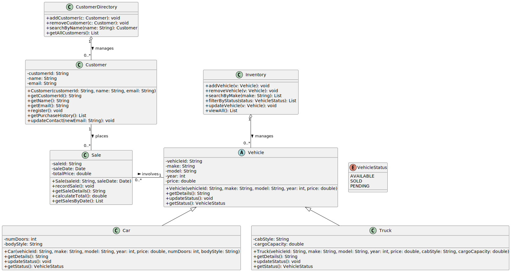

# CSC-331_Car_Dealership_Final_Project

This project is to develop a basic car dealership application that can inventory vehicles, customers, and purchases. 

Below is the structural design for our car dealership system, outlining the relationships between the different classes.

*Note: The source code for this diagram is maintained in PlantUML. You can view or edit the [PlantUML source file here](docs/CSC331-GP-UML-Syntax.puml).*
